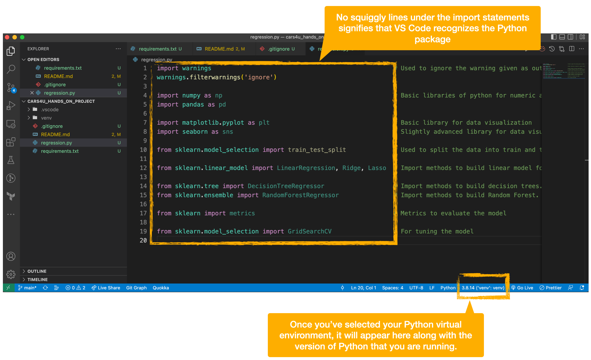

# MIT IDSS Data Science & Machine Learning Course

## Quick Start

1. create a Python virtual environment

  ```bash
  python3 -m venv venv
  source venv/bin/activate

  # check your Python version. anything version 3.x or higher should work fine
  python --version

  # verify that Python is running from your new virtual environment
  which python

  # verify that pip is running from your new virtual environment
  which pip

  # install any PyPi packages that we reference in this repo
  # see 
  pip install -r requirements.txt
  ```

  If all goes well then you'll see output similar to the following:

  ```bash
  (base) mcdaniel@MacBookAir-Lawrence cars4u_hands_on_project % python3 -m venv venv
  (base) mcdaniel@MacBookAir-Lawrence cars4u_hands_on_project % source venv/bin/activate
  (venv) (base) mcdaniel@MacBookAir-Lawrence cars4u_hands_on_project % python --version
  Python 3.8.14
  (venv) (base) mcdaniel@MacBookAir-Lawrence cars4u_hands_on_project % which python
  python: aliased to python3
  (venv) (base) mcdaniel@MacBookAir-Lawrence cars4u_hands_on_project % which pip
  /Users/mcdaniel/github/mit/cars4u_hands_on_project/venv/bin/pip
  (venv) (base) mcdaniel@MacBookAir-Lawrence cars4u_hands_on_project % pip install -r requirements.txt
  Collecting numpy
    Using cached numpy-1.23.3-cp38-cp38-macosx_11_0_arm64.whl (13.3 MB)
  Collecting pandas
    Downloading pandas-1.5.0-cp38-cp38-macosx_11_0_arm64.whl (10.7 MB)
      ━━━━━━━━━━━━━━━━━━━━━━━━━━━━━━━━━━━━━━━━ 10.7/10.7 MB 557.4 kB/s eta 0:00:00
  Collecting matplotlib
    Downloading matplotlib-3.6.0-cp38-cp38-macosx_11_0_arm64.whl (7.2 MB)
      ━━━━━━━━━━━━━━━━━━━━━━━━━━━━━━━━━━━━━━━━ 7.2/7.2 MB 1.1 MB/s eta 0:00:00
  Collecting seaborn
    Downloading seaborn-0.12.0-py3-none-any.whl (285 kB)
      ━━━━━━━━━━━━━━━━━━━━━━━━━━━━━━━━━━━━━━━━ 285.1/285.1 KB 3.8 MB/s eta 0:00:00
  Collecting sklearn
    Downloading sklearn-0.0.tar.gz (1.1 kB)
    Preparing metadata (setup.py) ... done
  Collecting python-dateutil>=2.8.1
    Using cached python_dateutil-2.8.2-py2.py3-none-any.whl (247 kB)
  Collecting pytz>=2020.1
    Downloading pytz-2022.4-py2.py3-none-any.whl (500 kB)
      ━━━━━━━━━━━━━━━━━━━━━━━━━━━━━━━━━━━━━━━━ 500.8/500.8 KB 460.8 kB/s eta 0:00:00
  Collecting pillow>=6.2.0
    Downloading Pillow-9.2.0-cp38-cp38-macosx_11_0_arm64.whl (2.8 MB)
      ━━━━━━━━━━━━━━━━━━━━━━━━━━━━━━━━━━━━━━━━ 2.8/2.8 MB 1.8 MB/s eta 0:00:00
  Collecting contourpy>=1.0.1
    Downloading contourpy-1.0.5-cp38-cp38-macosx_11_0_arm64.whl (225 kB)
      ━━━━━━━━━━━━━━━━━━━━━━━━━━━━━━━━━━━━━━━━ 225.9/225.9 KB 885.2 kB/s eta 0:00:00
  Collecting cycler>=0.10
    Downloading cycler-0.11.0-py3-none-any.whl (6.4 kB)
  Collecting kiwisolver>=1.0.1
    Downloading kiwisolver-1.4.4-cp38-cp38-macosx_11_0_arm64.whl (63 kB)
      ━━━━━━━━━━━━━━━━━━━━━━━━━━━━━━━━━━━━━━━━ 63.2/63.2 KB 459.2 kB/s eta 0:00:00
  Collecting packaging>=20.0
    Using cached packaging-21.3-py3-none-any.whl (40 kB)
  Collecting pyparsing>=2.2.1
    Using cached pyparsing-3.0.9-py3-none-any.whl (98 kB)
  Collecting fonttools>=4.22.0
    Downloading fonttools-4.37.4-py3-none-any.whl (960 kB)
      ━━━━━━━━━━━━━━━━━━━━━━━━━━━━━━━━━━━━━━━━ 960.8/960.8 KB 1.5 MB/s eta 0:00:00
  Collecting scikit-learn
    Using cached scikit_learn-1.1.2-cp38-cp38-macosx_12_0_arm64.whl (7.6 MB)
  Collecting six>=1.5
    Using cached six-1.16.0-py2.py3-none-any.whl (11 kB)
  Collecting threadpoolctl>=2.0.0
    Using cached threadpoolctl-3.1.0-py3-none-any.whl (14 kB)
  Collecting joblib>=1.0.0
    Using cached joblib-1.2.0-py3-none-any.whl (297 kB)
  Collecting scipy>=1.3.2
    Using cached scipy-1.9.1-cp38-cp38-macosx_12_0_arm64.whl (29.8 MB)
  Using legacy 'setup.py install' for sklearn, since package 'wheel' is not installed.
  Installing collected packages: pytz, threadpoolctl, six, pyparsing, pillow, numpy, kiwisolver, joblib, fonttools, cycler, scipy, python-dateutil, packaging, contourpy, scikit-learn, pandas, matplotlib, sklearn, seaborn
    Running setup.py install for sklearn ... done
  Successfully installed contourpy-1.0.5 cycler-0.11.0 fonttools-4.37.4 joblib-1.2.0 kiwisolver-1.4.4 matplotlib-3.6.0 numpy-1.23.3 packaging-21.3 pandas-1.5.0 pillow-9.2.0 pyparsing-3.0.9 python-dateutil-2.8.2 pytz-2022.4 scikit-learn-1.1.2 scipy-1.9.1 seaborn-0.12.0 six-1.16.0 sklearn-0.0 threadpoolctl-3.1.0
  WARNING: You are using pip version 22.0.4; however, version 22.2.2 is available.
  You should consider upgrading via the '/Users/mcdaniel/github/mit/cars4u_hands_on_project/venv/bin/python3.8 -m pip install --upgrade pip' command.
  (venv) (base) mcdaniel@MacBookAir-Lawrence cars4u_hands_on_project % 
  ```

2. Launch VS Code

  ```bash
  # executing this shortcut from the same file path which this README is located *should* simultaneously open VS Code and this project.
  code . 
  ```

3. Set the virtual environment

  From inside of VS Code, set the Python virtual environment. See [Using Python environments in VS Code](https://code.visualstudio.com/docs/python/environments). On a Mac you can use the hotkey "Shift Command P" to open a drop-down list of Python interpreters.

